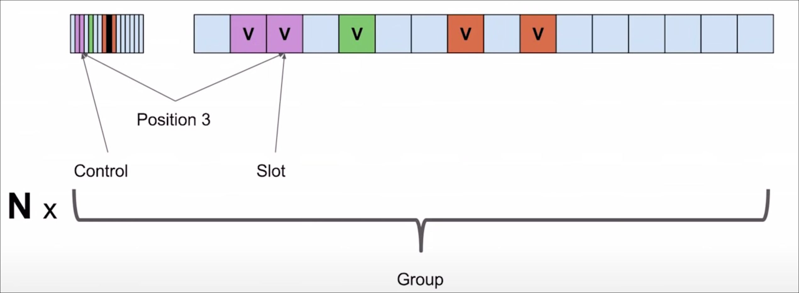
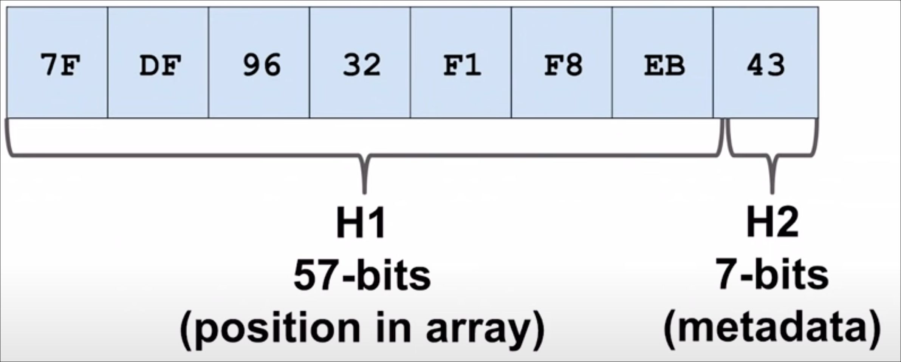
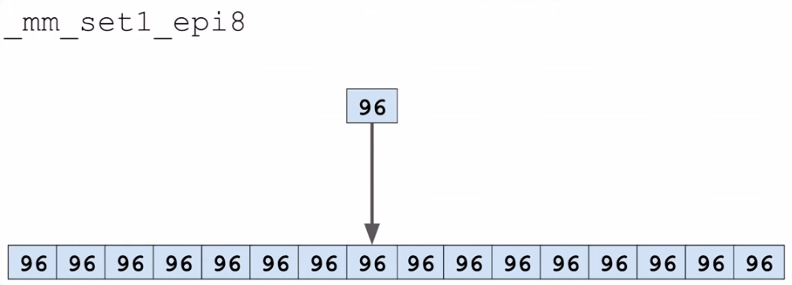
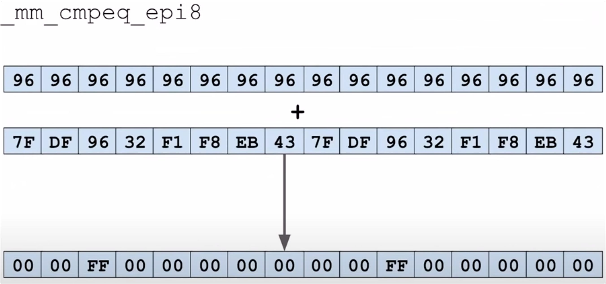
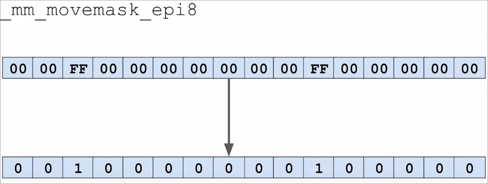
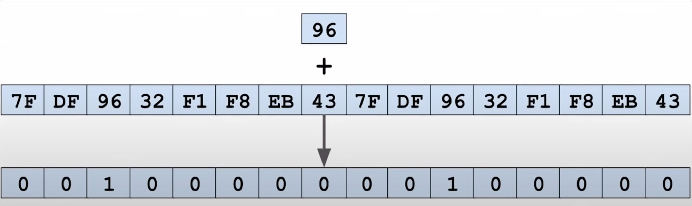
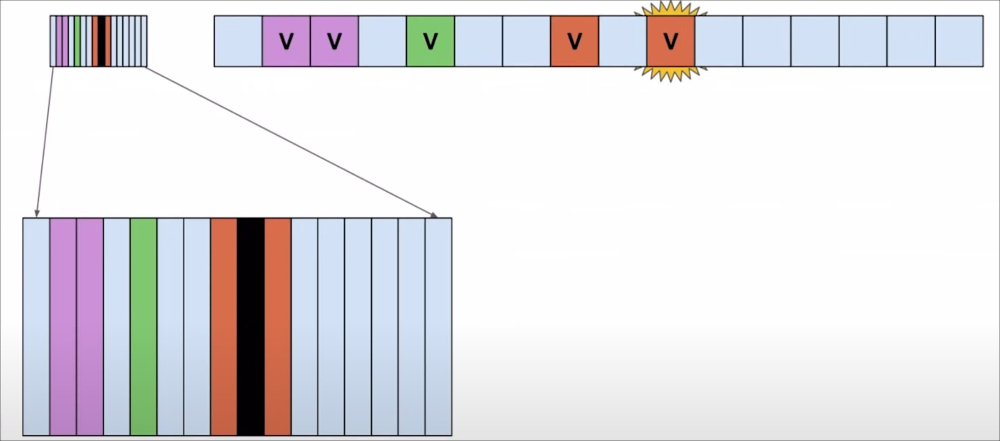

# Flat Hash Set & Map in Python

A flat Hash Set and Map implementation from **abseil** `C++` library implemented in `Python` using `Cython` in order to use **SSE2** instructions.
This implementation was made following the great presentation from **Matt Kulukundis** on **CppCon 2017** [^hashmatt2017] and inspired by the Golang port made [^goswiss].


[^hashmatt2017]: [CppCon 2017: Matt Kulukundis "Designing a Fast, Efficient, Cache-friendly Hash Table, Step by Step"](https://www.youtube.com/watch?v=ncHmEUmJZf4)

[^goswiss]: [Golang port of Abseil's SwissTable](https://github.com/dolthub/swiss/tree/main)


## Index

<!-- TOC -->
* [Flat Hash Set & Map in Python](#flat-hash-set--map-in-python)
  * [Index](#index)
  * [Examples](#examples)
    * [Hash Map](#hash-map)
    * [Hash Set](#hash-set)
  * [Executing the automated tests](#executing-the-automated-tests)
  * [Implementation](#implementation)
    * [Groups](#groups)
    * [Keys Metadata (Control)](#keys-metadata-control)
    * [Hash](#hash)
    * [SSE](#sse)
    * [Using SSE instructions from Python](#using-sse-instructions-from-python)
  * [Complexity analysis](#complexity-analysis)
    * [Time complexity Table](#time-complexity-table)
      * [Hash table](#hash-table)
      * [Hash set](#hash-set-1)
    * [Robin hood hash](#robin-hood-hash)
<!-- TOC -->


## Examples

### Hash Map

```python
from hash_map import FlatHashMap

hash_map = FlatHashMap()
key = 'a'
hash_map[key] = 1

if key in hash_map:
  print(f"Contains key: {key}")
```

### Hash Set

```python
from hash_set import FlatHashSet

a = FlatHashSet()
b = FlatHashSet()

amount = 100
amount_second = int(amount / 2)

for i in range(amount):
    a.add(i)

for i in range(amount_second):
    a.add(i)

fhs3 = a.intersection(b)
```

## Executing the automated tests

```shell
python -m unittest discover -s ./tests -t ./tests
```


## Implementation

The implementation uses `Open Addressing` which is an alternative way to handle hash collisions without using linked lists.
Each key is placed in the table by searching for an empty slot in a process called **probing**.
There are different types of **probing** that could be used [^probing]:

- Linear probing: Sequentially finds inside the hash table.
- Quadratic probing: Quadratically finds inside the hash table.
- Double hashing: Find inside the hash table by hashing the key again.

The linear probing is used due to the `L1`, `L2`, `L3` caches, the subsequent keys can be loaded faster which can potentially improve the performance.

[^probing]: [Linear Probing | Open Addressing | Hash Tables](https://carmencincotti.com/2022-10-10/linear-probing-open-addressing-hash-tables/)


### Groups

The table is partitioned into groups of the same size.
We use **16** for the group size in order to **efficiently** find keys in the group by using **SSE** instructions.
We can **efficiently** find a key in the group by loading all the **16** control bytes into a `__m128i` and using **3 SSE instructions**.




### Keys Metadata (Control)

For each key a whole byte is stored in a `control` metadata array.
This metadata is used to find the keys more efficiently by using `SIMD` instructions and to handle removal cases
when the key can't be deleted or a find might not find another key which is after it.
The metadata **byte** indicates the state of the key, which can be `empty`, `deleted`, or `full` which contains its first `7 bits` hash.

```python
class ControlFlag(Enum):
    FULL    = 0b0hhh_hhhh # hash
    EMPTY   = 0b1000_0000 # 128
    DELETED = 0b1111_1110 # 254
```


### Hash

The hash of the key is divided in two parts, `H1` which contains the `57` most significant bits of the key and `H2` which contains the first `7` bits.

```python
def split_hash(h: int) -> Tuple[int, int]:
    return (h & Mask.HASH_1.value) >> 7, h & Mask.HASH_2.value
```



- The `H1` hash is used to find the group in which the key would be inserted.
- The `H2` hash will be the control byte, which will be used in the SSE instructions to efficiently find the key.


### SSE

We can **efficiently** search for a hash in a group with **16 keys** by loading all the **16** control bytes into a `__m128i` bit vector.
By using **3 SSE instructions**: 

1. The instruction `_mm_set1_epi8` creates a `__m128i` bit vector with **16 bytes** filled with the given `byte`.



2. The instruction `_mm_cmpeq_epi8` compares two `__m128i` byte vector, returning a `__m128i` byte vector with `0xFF` where the bytes are aligned.



3. The instruction `_mm_movemask_epi8` returns a **64 bit** vector (**8 bytes**) with the most significant bit of each byte.
In this case, it returns **1** when the byte is `0xFF`



These instructions combined return a **64 bit** mask which contains the position of the keys that matched the given hash.



We can then use each bit to efficiently find the key in the group by checking if the key is in the corresponding position.

```python
while True:
    keys = _control_keys_at_index_(group_index)

    matches = sse_match.find_matches(h2, keys)

    while matches != 0:
        match, bitmask = sse_match.next_match(matches)
        index = (probe_index + match) % self._pairs.__len__()

        if key == self._pairs[index][0]:
            return True

        matches = bitmask
```




> The images used in this explanation are from the presentation 
> `CppCon 2017: Matt Kulukundis "Designing a Fast, Efficient, Cache-friendly Hash Table, Step by Step"` [^hashmatt2017].


### Using SSE instructions from Python

In order to use **SSE** instructions the implementation uses `Cython`.
We followed the example [Simple example for embedding SSE2 assembly in Cython projects](https://github.com/Technologicat/cython-sse-example)
to map the **SSE2** instructions required to implement the hash matcher.
The [sse_match.pyx](./sse_match.pyx) file contains the mapped **SSE** instructions:

```cython
cdef extern from "emmintrin.h":
    # Two things happen here:
    # - this definition tells Cython that, at the abstraction level of the Cython language, 
    #   __m128d "behaves like a double" and __m128i "behaves like a fixed size long array"
    # - at the C level, the "cdef extern from" (above) makes the generated C code look up 
    #   the exact definition from the original header
    #
    ctypedef double __m128d
    ctypedef long long int[2] __m128i

    # Declare any needed extern functions here; consult $(locate emmintrin.h) and SSE assembly documentation.
    __m128i _mm_set_epi8(char __q15, char __q14, char __q13, char __q12,
                 char __q11, char __q10, char __q09, char __q08,
                 char __q07, char __q06, char __q05, char __q04,
                 char __q03, char __q02, char __q01, char __q00) nogil

    __m128i _mm_store_si128(__m128i * dest, __m128i a) nogil
    __m128i _mm_set1_epi8(char v) nogil
    __m128i _mm_cmpeq_epi8(__m128i __A, __m128i __B) nogil
    int _mm_movemask_epi8(__m128i __A) nogil
```


## Complexity analysis

The expected average and best case for `Search`, `Insert` and `Delete` is `O(1)` when the key can be find in the first probe.
Because we might need to traverse all the items to search for a given key when the table is full 
(Which can be avoided by using a load factor lesser than 1.0) the worst case is `O(n)`.
However, due to the use of `SSE` instructions we can search in **3 instructions** a group with **16 keys**,
which makes the worst case `O(n)` still performant.

The expected space complexity is `O(n)` due to the contiguous array allocated for the key pairs and the control bytes array.


### Time complexity Table

#### Hash table

| Operation    | Best Case | Average Case | Worst Case |
|--------------|-----------|--------------|------------|
| Search       | O(1)      | O(1)         | O(n)       |
| Insert       | O(1)      | O(1)         | O(n)       |
| Delete       | O(1)      | O(1)         | O(n)       |

#### Hash set

| Operation    | Best Case | Average Case | Worst Case |
|--------------|-----------|--------------|------------|
| Intersection | O(1)      | O(n)         | O(n)       |
| Union        | O(1)      | O(n)         | O(n)       |
| Difference   | O(1)      | O(n)         | O(n)       |


### Robin hood hash

According to `Matt Kulukundis` this implementation has a similar performance as the Robin hood hash due to the use of **SSE** instructions and the control bytes which can better use the processor's cache.
